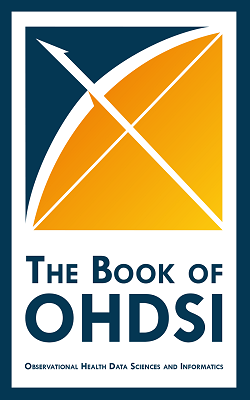

HADES (formally known as the OHDSI Methods Library) is a set of open source R packages for large scale analytics, including population characterization, population-level causal effect estimation, and patient-level prediction.

The packages offer R functions that together can be used to perform an observation study from data to estimates and supporting statistics, figures, and tables. The packages interact directly with observational data in the [Common Data Model (CDM)](https://ohdsi.github.io/CommonDataModel/), and are designed to support both large datasets and large numbers of analyses (e.g. for testing many hypotheses including control hypotheses, and testing many analyses design variations). For this purpose, each Method package includes functions for specifying and subsequently executing multiple analyses efficiently. HADES supports best practices for use of observational data as learned from previous and ongoing research, such as transparency, reproducibility, as well as measuring of the operating characteristics of methods in a particular context and subsequent empirical calibration of estimates produced by the methods.

HADES has already been used in many published clinical and methodological studies, as can be seen in the [Publications section](publications.html).

# Installation

See the Support section for instructions on [setting up the R environment](rSetup.html) for HADES, including Java and RTools. Each package in HADES can be installed independently, but it is also possible to install all HADES packages at once, as described [here](installingHades.html). You can learn how connect to your database using HADES [here](connecting.html).

# Learn How to Use HADES

 Learn how to use HADES to produce reliable evidence from real-world data with The Book of OHDSI. Read it <a href="http://book.ohdsi.org">online</a>.

## Technology

HADES is a set of R packages that execute against data in a database server. HADES supports traditional database systems (PostgreSQL, Microsoft SQL Server, and Oracle), parallel data warehouses (e.g. Amazon RedShift), as well as 'Big Data' platforms (e.g. Google BigQuery). HADES does *not* support MySQL. The full list of supported database platforms can be found [here](supportedPlatforms.html).

## License

All packages in HADES are licensed under the [Apache License 2.0](https://www.apache.org/licenses/LICENSE-2.0), which allows users to use the software for any purpose, to distribute it, to modify it, and to distribute modified versions of the software under the terms of the license, without concern for royalties.
