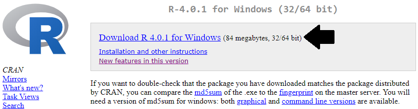

Here are the steps for installing the required environment to run the OHDSI R packages. Four things needs to be installed: 

1. **R** is a statistical computing environment. It comes with a basic user interface that is primarily a command-line interface.
2. **RTools** is a set of programs that is required on Windows to build R packages from source.
3. **RStudio** is an IDE (Integrated Development Environment) that makes R easier to use. It includes a code editor, debugging and visualization tools. Please use it to obtain a nice R experience.
4. **Java** is a computing environment that is needed to run some of the components in the OHDSI R packages, for example those needed to connect to a database.

# Instructions for Windows

These instructions are also demonstrated in [this video](https://youtu.be/DjVgbBGK4jM), showing a step-by-step guide to installing the required software.

```{block2, type='rmdimportant'}
In Windows, both R and Java come in 32-bit and 64-bits architectures. If you install R in both architectures, you **must** also install Java in both architectures. It is recommended to only install the 64-bit version of R.
```

## Installing R

1. Go to [https://cran.r-project.org/](https://cran.r-project.org/), click on 'Download R for Windows', then 'base', then click the Download link indicated in the screenshot below.

   

2. After the download has completed, run the installer. Use the default options everywhere, with two exceptions: First, it is better not to install into program files. Instead, just make R a subfolder of your C drive as shown below. Second, to avoid problems due to differing architectures between R and Java, disable the 32-bit architecture as also shown below.
   
   
   

Once completed, you should be able to select R from your Start Menu. 

## Installing RTools

1. Go to [https://cran.r-project.org/](https://cran.r-project.org/), click on 'Download R for Windows', then 'Rtools', and select the very latest version of RTools to download.

2. After downloading has completed run the installer. Select the default options everywhere.

3. Since R v4.0.0 you also need to add the following line to your .Renviron file, as described on the RTools page:

    ```
    PATH="${RTOOLS40_HOME}\usr\bin;${PATH}"
    ```
	
## Installing RStudio

1. Go to [https://www.rstudio.com/](https://www.rstudio.com/), select 'Download RStudio' (or the 'Download' button under 'RStudio'), opt for the free version, and download the installer for Windows as highlighted below.
   

2. After downloading, start the installer, and use the default options everywhere.

## Installing Java

1. Go to [https://java.com/en/download/manual.jsp](https://java.com/en/download/manual.jsp), and select the Windows 64-bit installer as highlighted below. If you also installed the 32-bit version of R, you *must* also install the other (32-bit) version of Java.
    

2. After downloading just run the installer.


# Instructions for Mac

## Installing R

1. Go to [https://cran.r-project.org/](https://cran.r-project.org/), click on 'Download R for (Mac) OS X', then 'base', then click the Download link indicated in the screenshot below.

   
   
2. After the download has completed, run the installer and accept all of the default options. You should see a screen indicating that the installation was successful.

    

## Installing R build tools

We will need to install C and Fortran compilers in order to build R packages from source code. These are included with Xcode which can be downloaded from the Mac App store. 

1. Open the App Store in Mac OS and install Xcode. Xcode is a large program. If disk space is scarce you could also try only installing Xcode command line tools by following the instructions [here](https://railsapps.github.io/xcode-command-line-tools.html).  Verify that the C compiler gcc is installed by opening the terminal and running the command `clang`. You should see an error that says "no input files".

2. Download and install the gfortran compiler .dmg from https://github.com/fxcoudert/gfortran-for-macOS/releases. Choose the latest version that is compatible with your operating system. Verify the installation by opening the terminal and running the command `gfortran`. You should see an error that says "no input files".

3. Go to [https://www.xquartz.org/](https://www.xquartz.org/), download the .dmg and run the installer.

4. Verify that build tools are installed and available by opening an R console and running

```{r, eval=FALSE}
install.packages("pkgbuild")
pkgbuild::check_build_tools()
```


## Installing RStudio

1. Go to [https://www.rstudio.com/](https://www.rstudio.com/), select 'Download RStudio' (or the 'Download' button under 'RStudio'), opt for the free version, and download the installer for Mac as highlighted below.
   
   
## Installing Java

1. Go to [https://www.oracle.com/java/technologies/javase-jdk15-downloads.html](https://www.oracle.com/java/technologies/javase-jdk15-downloads.html), and select the Mac OS installer for the Oracle JDK as highlighted below. 
    

2. After downloading just run the installer. Check that java is installed by opening the terminal and running the command `java`. If you see some helpful output about usage then the installation was successful.

# Verifying the installation

You should now be ready to go, but we should make sure. Start R-studio, and type

```{r eval=FALSE}
install.packages("SqlRender")
library(SqlRender)
translate("SELECT TOP 10 * FROM person;", "postgresql")
```
```{r echo=FALSE}
library(SqlRender)
translate("SELECT TOP 10 * FROM person;", "postgresql")
```

This function uses Java, so if all goes well we know both R and Java have been installed correctly!

Another test is to see if source packages can be built. Run the following R code to install the `CohortMethod` package from the OHDSI GitHub repository:
```{r eval=FALSE} 
install.packages("remotes")
remotes::install_github("OHDSI/CohortMethod")
```

# GitHub Personal Access Token

Installing HADES packages requires downloads from GitHub. Unfortunately, GitHub has a cap on how many downloads an anonymous user can make in a short amount of time, and this cap is reached when trying to download all HADES packages. To avoid this cap, we need to authenticate ourselves using our GitHub account. A known GitHub user has a much higher download cap, and can install HADES without issues. We can authenticate ourselves by first creating a **Personal Access Token** (PAT), and then providing this to R.

Fortunately, you will need to do this only once. After you've set your PAT in R, you can rely on it to be there in all your future R sessions.

## Creating a Personal Access Token

Before we can create a PAT, you must make sure that you have a valid GitHub account. You can create one for free at [GitHub.com](https://github.com/).

The easiest way to create a GitHub PAT is by using the [usethis](https://usethis.r-lib.org/) package. Running this code will open a browser that allows you to generate a PAT:


```{r eval=FALSE}
install.packages("usethis")
library(usethis)
create_github_token(scopes = c("(no scope)"), description = "R:GITHUB_PAT", host = "https://github.com")
```

You may need to log on to GitHub. Note that the PAT does not require any of the permissions listed, so you can leave all checkboxes unchecked. Scroll down and click on 'Generate token' to generate your PAT. Your PAT is a sequence of 40 letters and numbers. Make sure to copy your PAT, because you will not be able to see it again once you close your browser!

## Adding your Personal Access Token to R

Next, we need to make the PAT available to R. For this we need to add a line to the `.Renviron` file that looks like this:

```
GITHUB_PAT = 'a1b2c3d4e5f6g7h8g9h0ijklmnopqrstuvwxyz'
```

where 'a1b2c3d4e5f6g7h8g9h0ijklmnopqrstuvwxyz' is your PAT.

The easiest way to edit your `.Renviron` file is by using the `usethis` package again:

```{r eval=FALSE}
edit_r_environ()
```

This will open `.Renviron` in a text editor. Add the line with your PAT, save the file, and restart R. The PAT will now be available to the various R functions.
