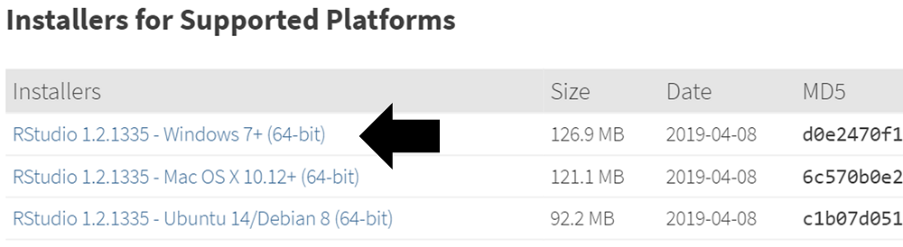

Here are the steps for installing the required environment to run the OHDSI R packages. Four things needs to be installed: 

1. **R** is a statistical computing environment. It comes with a basic user interface that is primarily a command-line interface.
2. **RTools** is a set of programs that is required on Windows to build R packages from source.
3. **RStudio** is an IDE (Integrated Development Environment) that makes R easier to use. It includes a code editor, debugging and visualization tools. Please use it to obtain a nice R experience.
4. **Java** is a computing environment that is needed to run some of the components in the OHDSI R packages, for example those needed to connect to a database.

# Instructions for Windows

```{block2, type='rmdimportant'}
In Windows, both R and Java come in 32-bit and 64-bits architectures. If you install R in both architectures, you **must** also install Java in both architectures. It is recommended to only install the 64-bit version of R.
```

## Installing R

1. Go to [https://cran.r-project.org/](https://cran.r-project.org/), click on 'Download R for Windows', then 'base', then click the Download link indicated in the screenshot below.

   

2. After the download has completed, run the installer. Use the default options everywhere, with two exceptions: First, it is better not to install into program files. Instead, just make R a subfolder of your C drive as shown below. Second, to avoid problems due to differing architectures between R and Java, disable the 32-bit architecture as also shown below.
   
   
   

Once completed, you should be able to select R from your Start Menu. 

## Installing RTools

1. Go to [https://cran.r-project.org/](https://cran.r-project.org/), click on 'Download R for Windows', then 'Rtools', and select the very latest version of RTools to download.

2. After downloading has completed run the installer. Select the default options everywhere.

3. Since R v4.0.0 you also need to add the following line to your .Renviron file, as described on the RTools page:

    ```
    PATH="${RTOOLS40_HOME}\usr\bin;${PATH}"
    ```
	
## Installing RStudio

1. Go to [https://www.rstudio.com/](https://www.rstudio.com/), select 'Download RStudio' (or the 'Download' button under 'RStudio'), opt for the free version, and download the installer for Windows as highlighted below.
   

2. After downloading, start the installer, and use the default options everywhere.

## Installing Java

1. Go to [https://java.com/en/download/manual.jsp](https://java.com/en/download/manual.jsp), and select the Windows 64-bit installer as highlighted below. If you also installed the 32-bit version of R, you *must* also install the other (32-bit) version of Java.
    

2. After downloading just run the installer.

# Verifying the installation

You should now be ready to go, but we should make sure. Start R-studio, and type

```{r eval=FALSE}
install.packages("SqlRender")
library(SqlRender)
translate("SELECT TOP 10 * FROM person;", "postgresql")
```
```{r echo=FALSE}
library(SqlRender)
translate("SELECT TOP 10 * FROM person;", "postgresql")
```

This function uses Java, so if all goes well we know both R and Java have been installed correctly!

Another test is to see if source packages can be built. Run the following R code to install the `CohortMethod` package from the OHDSI GitHub repository:
```{r eval=FALSE}
install.packages("drat")
drat::addRepo("OHDSI")
install.packages("CohortMethod")
```

